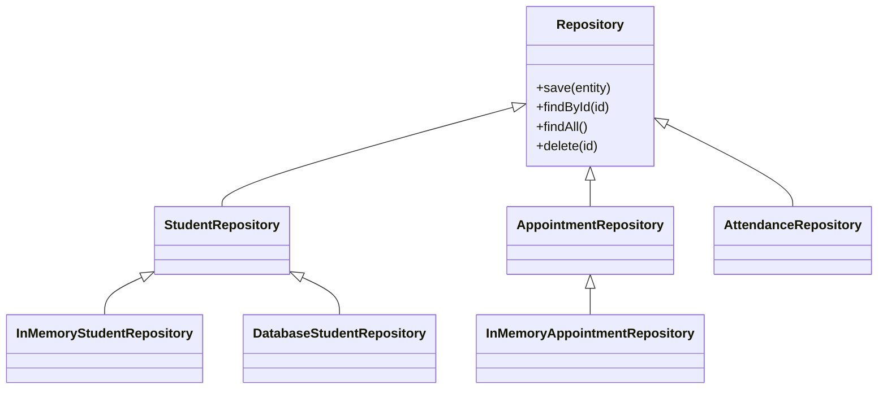

```mermaid
classDiagram

class Repository {
    +save(entity)
    +findById(id)
    +findAll()
    +delete(id)
}

class StudentRepository
class AppointmentRepository
class AttendanceRepository

class InMemoryStudentRepository
class InMemoryAppointmentRepository
class DatabaseStudentRepository

Repository <|-- StudentRepository
Repository <|-- AppointmentRepository
Repository <|-- AttendanceRepository

StudentRepository <|-- InMemoryStudentRepository
AppointmentRepository <|-- InMemoryAppointmentRepository
StudentRepository <|-- DatabaseStudentRepository
```